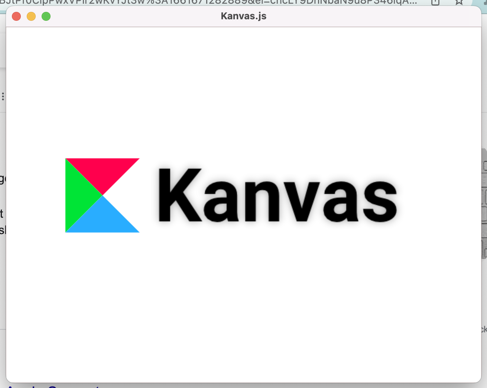

# Kanvas.js

A tiny Javascript interpreter with a canvas (2d) implementation. It aims to implement a subset of Browser APIs to enable the development/porting of games, visualizations and canvas-based application



It should be easily portable to any platform capable of running OpenGL ES 2. So far it has been tested with

* MacOS (arm64)
* Windows (x64)
* Linux (x86)
* RaspberryPI (arm)

## Installation

None, yet. See "Buidling".

## Getting Started

Here's some boilerplate that produces above image. 
```javascript
// make sure our code works in canvas and the browser
var canvas = window["kanvas"] ? window["kanvas"] : document.getElementById("canvas")
var ctx = canvas.getContext("2d");

function drawTriangle(x1,y1,x2,y2,x3,y3,color){
  ctx.fillStyle = color
  ctx.beginPath()
  ctx.moveTo(x1,y1)
  ctx.lineTo(x2,y2)
  ctx.lineTo(x3,y3)
  ctx.closePath()
  ctx.fill()
}

function sinval(t,s,a) {
  return Math.sin(t*s) * a
} 

function loop(time){
    ctx.fillStyle = "#fff"
    ctx.fillRect(0,0,640,480)

    ctx.translate(80, 175 + sinval(time/1000,2,20))

    drawTriangle(0,0,100,0,50,50,"#FF004D")
    drawTriangle(0,0,50,50,0,100,"#00E436")
    drawTriangle(50,50,100,100,0,100,"#29ADFF")

    ctx.font = "bold 100px sans-serif"
    ctx.fillStyle = "#000"
    ctx.shadowBlur = 10
    ctx.shadowColor = "#00000066"
    ctx.fillText("Kanvas",120,85)

    ctx.shadowBlur = 0
    ctx.resetTransform();

    requestAnimationFrame(loop);
}

requestAnimationFrame(loop);
```
The code works just like it would on the browser. The only difference is, that a global `kanvas` object exists where we can get a `RenderingContext2d` from.

Save as `canvas.js` and run `./canvas canvas.js`

## Compatibility

Kanvas.js aims to implement a subset of belowmentioned browser APIs. That means that Kanvas apps will generally run in the browser but not vice-versa.

### Javascript

Kanvas is based on Duktape and therefore mostly supports ES5. It is recommended to use Babel or Typescript to compile your code down to ES5. There is also no module support yet. So no `require` or `import`. It is therefore recommended to use a bundler like Webpack or Rollup to bundle modules into a single js-file. An example project with Webpack and Typescript can be found in the `templates` folder. 

> Kanvas pre-loads a polyfill (`core-js`) for ES6 primitives like `Promise`, `Map`, `Set` etc..So you don't have to polyfill them yourself.

### Quick note about Promises

Promises should run as microtasks after synchronous code finishes. Kanvas emulates this behaviour by manually running the task queue after the following occasions

 * After running a Javascript file
 * After an event handler finishes execution
 * After running an animation frame

### Supported browser APIs 

As mentioned above, Kanvas only supports a small set or browser APIs. Just enough to keep browser compatibility. Instead of listing, what is supported, it makes more sense to show how to do stuff.

**Canvas**

Kanvas has a global singleton instance of a HTMLCanvasElement called `kanvas`
```javascript
var canvas = window["kanvas"] ? window["kanvas"] : document.getElementById("canvas")

console.log(canvas.width, canvas.height)
```

**Events**

Events can be received either through the global `kanvas` object or the global `window` object. Not all properties are implemented.
Events are dispatched from the main loop which tries to maintain 60 frames per second.
```javascript
function onmove(ev){
  console.log(ev.offsetX, ev.offsetY)
}

function onkey(ev){
  console.log(ev.key)
}

kanvas.addEventListener('mousemove', onmove)
window.addEventListener('keydown', onkey)

// ...

kanvas.removeEventListener('mousemove', onmove)
kanvas.removeEventListener('keydown', onkey)
```

|Event|Dispatched on|Properties 
|---|---|---|
|mousemove|kanvas|type,offsetX,offsetY|
|mousedown|kanvas|type,offsetX,offsetY,button|
|mouseup|kanvas|type,offsetX,offsetY,button|
|click|kanvas|type,offsetX,offsetY,button|
|keyup|window|type,repeat,altKey,ctrlKey,key|
|keydown|window|type,repeat,altKey,ctrlKey,key|

**Animation Frame**

`requestAnimationFrame` works just like in the browser.
```javascript
// run a render loop
function loop(time){
  // do your rendering here
  requestAnimationFrame(loop)
}
requestAnimationFrame(loop)
```

> **An important note about rendering**: In the browser you can render to the canvas anytime you want and buffer swapping happens implicit. Kanvas does not mimic this behaviour (yet) and uses a traditional render loop. Therefore **all drawing must take place in the animation frame callback** or you will get unexpected results

**Local Storage**

There is basic support for local storage APIs but not session storage (as there is no concept of a session). Data is stored in the CWD (subject to change) as `{js_filename}.storage` file.
```javascript
localStorage.setItem('my key', 'my value')

// later...

localStorage.getItem('my key')
localStorage.removeItem('my key')
localStorage.clear()
```

**Fetch**

There is some basic fetch support but only for local files. There is no HTTP client (yet). Also fetch calls return a Promise but are not really asynchronous under the hood.
```javascript
fetch('myfile').then(function(response){
  response.arrayBuffer(function(mybuffer) { })
  response.text(function(mytext) { })
  response.json(function(myObject) { })
  response.blob(function(myblob) {
    // blob only supports array buffer
    myblob.arrayBuffer().then(function(mybuffer) { })
  })
})
```

**Image Bitmap**

Currently `ImageBitmap` is the only supported source for drawing images. There is currently only one way to create it.
```javascript
fetch('myimage.png').then(function(response){
  response.blob().then(function(blob){
    createImageBitmap(blob).then(function(image){
      // use image for drawing
    })
  })
})
```
If you can use `async/await` it becomes a bit easier
```javascript
async function loadImage(file: string){
  return await createImageBitmap(await (await fetch(file)).blob());
}
```

**Audio**

Audio is supported through the `Audio` constructor. You can control weather audio is streamed or not through the `preload` attribute.
```javascript
var audio = new Audio()
audio.src = 'myaudio.mp3'
audio.preload = 'auto'
// full audio is loaded into memory e.g. for sound effects
audio.play()

var audio2 = new Audio('myaudio.ogg')
// audio is streamed from disk e.g. for BG music
audio2.play()
```

### RenderingContext2d

Not full support here yet. Some of it should be fairly easy to implement due to NanoVGs similarity to HTML canvas, some of it will probably not be supported ever.

|API|Support| 
|---|---|
|globalAlpha|       yes|
|drawImage|         partial (only `ImageBitmap` supported for now)|
|beginPath|         yes|
|clip|              no|
|fill|              yes|
|isPointInPath|     no|
|isPointInStroke|   no|
|stroke|            yes|
|fillStyle|         partial (only solid colors)|
|strokeStyle|       partial (only solid colors)|
|createConicGradient|no|
|createLinearGradient|no|
|createPattern|     no|
|createRadialGradient|no|
|filter|            no|
|createImageData|   no|
|getImageData|      no|
|putImageData|      no|
|imageSmoothingEnabled|no|
|imageSmoothingQuality|no|
|arc|               yes|
|arcTo|             no|
|bezierCurveTo|     yes|
|ellipse|           partially (no rotation)|
|lineTo|            yes|
|moveTo|            yes|
|quadraticCurveTo|  yes|
|rect|              yes|
|lineCap|           no|
|lineDashOffset|    no|
|lineJoin|          no|
|lineWidth|         yes|
|miterLimit|        no|
|getLineDash|       no|
|setLineDash|       no|
|clearRect|         yes|
|fillRect|          yes|
|strokeRect|        no|
|shadowBlur|        partial (text only)|
|shadowColor|       yes|
|shadowOffsetX|     yes|
|shadowOffsetY|     yes|
|restore|           no|
|save|              no|
|fillText|          yes|
|measureText|       yes|
|strokeText|        no|
|direction|         no|
|font|              yes|
|textAlign|         yes|
|textBaseline|      yes|
|resetTransform|    yes|
|rotate|            yes|
|scale|             yes|
|setTransform|      no|
|transform|         no|
|translate|         yes|
|drawFocusIfNeeded| no|
|canvas|            yes (returns window.kanvas)|
|getContextAttributes|yes (empty)|

### Window and Font handling

As Kanvas exists in a space without a DOM or CSS, relevant attributes must be configured through `kanvas.json`. Here's an example:

```json
{
    "width": 1280,
    "height": 720,
    "retina": true,
    "title": "Kanvas!", 
    "resizable": true,
    "fonts": {
        "sans-serif": "assets/fonts/Roboto/Roboto-Regular.ttf",
        "sans-serif:bold": "assets/fonts/Roboto/Roboto-Bold.ttf",
        "sans-serif:italic": "assets/fonts/Roboto/Roboto-Italic.ttf",
        "sans-serif:bold:italic": "assets/fonts/Roboto/Roboto-BoldItalic.ttf",
        "serif": "assets/fonts/NotoSerif/NotoSerif-Regular.ttf",
        "serif:bold": "assets/fonts/NotoSerif/NotoSerif-Bold.ttf",
        "serif:italic": "assets/fonts/NotoSerif/NotoSerif-Italic.ttf",
        "serif:bold:italic": "assets/fonts/NotoSerif/NotoSerif-BoldItalic.ttf",
        "Neucha": "assets/fonts/Neucha/Neucha-Regular.ttf",
        "PatrickHand": "assets/fonts/Patrick_Hand/PatrickHand-Regular.ttf"
    }
}
```

## Building

Kanvas uses CMake for building.

### Dependencies

* SDL2 
* ANGLE (EGL / OpenGL ES 2 implementation on desktop platforms)

Static dependencies (created on build)
* duktape (JS interpreter)
* nanovg (2d drawing)
* soloud (audio)

### Instructions

Building on Windows has only been tested with Mingw32

```
git submodule init
git submodule update --recursive
mkdir build
cd build
cmake ..
cmake --build .
```

